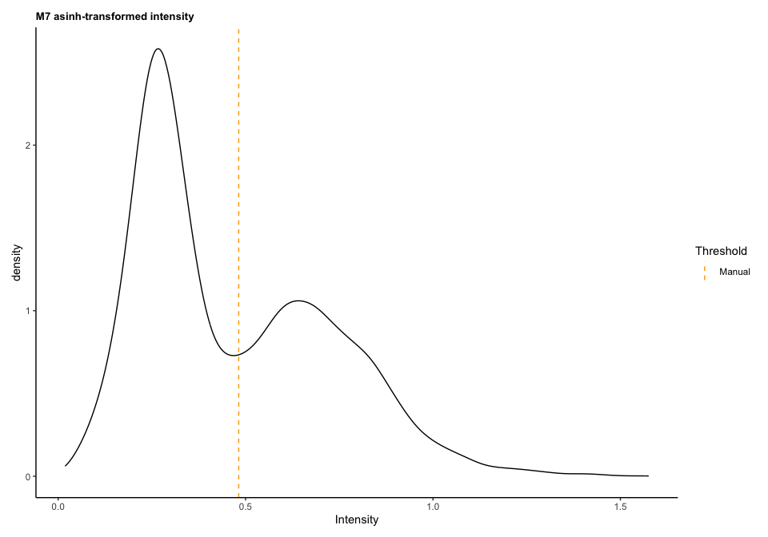
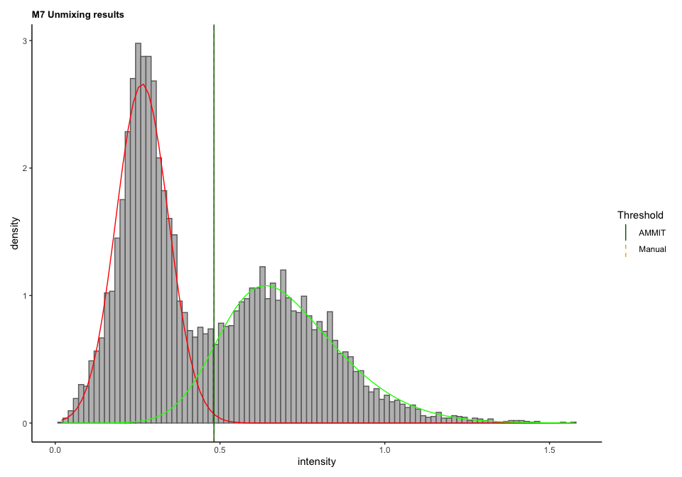
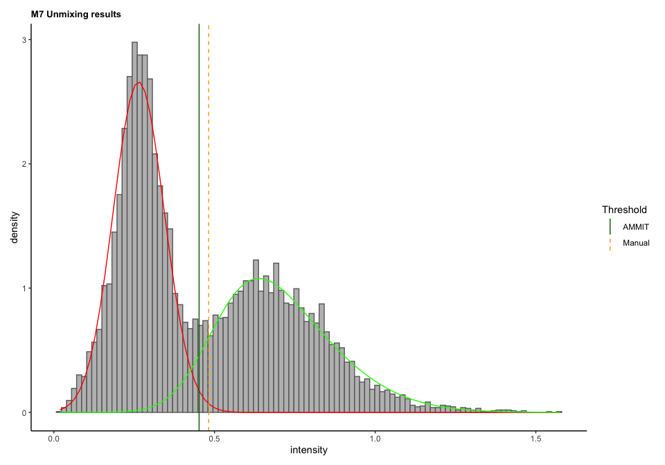

<!-- README.md is generated from README.Rmd. Please edit that file -->

# AMMIT

<!-- badges: start -->
<!-- badges: end -->

AMMIT is an R package from members of the Neeson Lab, designed to
streamline the processing of many mIHC samples by applying a skew-normal
mixture model trained on a small subset of samples.

## Installation

You can install the development version of AMMIT from
[GitHub](https://github.com/) with:

``` r
library(devtools)
devtools::install_github("neeson-lab/AMMIT")
```

## Basic AMMIT workflow

<figure>

<figcaption aria-hidden="true">Workflow for using AMMIT to threshold a
cohort of mIHC data.</figcaption>
</figure>

### Reading in your data

You can read in your data from a HALO file (often titled
“Total_Object_Results.csv”) or you can feed it in directly. Data is
converted into the SpatialExperiment class.

The data for the following examples is accessible within the AMMIT
package:

``` r
data("ammit_spe_dummy")
eg_markers <-  c("M1", "M2", "M3", "M4", "M5", "M6", "M7")
```

The object contains two ‘assays’ - a ‘data’ assay which contains the
intensity data for each marker and cell, and a ‘reference’ assay which
contains the manually-thresholded state for each marker and cell. Note
that in instances where you are not training or validating, your object
does not need to have reference data.

As we progress with AMMIT, most of our results will be stored in the
`rowData` of this object, which carries metadata for each individual
marker (the rows of our SpatialExperiment object), independent of cells.
Later down the track, cell phenotypes and so on will be stored in the
`colData`.

It was built like this:

``` r
# ammit_spe_dummy <- build_ammit_spe(method = "HALO",
#                                    markers = eg_markers,
#                                    reference = TRUE,
#                                    HALO_filepath = system.file("extdata", "halo_output.csv", package="AMMIT"),
#                                    locations = c("Nucleus", "Cytoplasm", "Nucleus", "Cytoplasm", "Cytoplasm", "Cytoplasm", "Cytoplasm"),
#                                    filter_dapi = TRUE)
```

Note that if your data does not include DAPI positivity classification
(e.g. segmentation was completed without setting a threshold for DAPI
positivity) you can set `filter_dapi` to `FALSE`.

The reference parameter here is set to `TRUE`, indicating this data has
already been manually-thresholded and can be used to train (or validate)
the strictness parameter for the AMMIT workflow. However, to do this we
also need the manual thresholds themselves. While it is possible to read
them in when building the SpatialExperiment object, here we will apply a
simple function to pull them from the reference and intensity data for
each marker.

``` r
ammit_spe_dummy <- infer_manual_thresholds(ammit_spe_dummy, eg_markers)
```

### Plotting marker intensity densities

We might like to examine our data at this stage. AMMIT allows for the
basic plotting of the distribution of the marker intensities using the
`plot_intensities` function. Let’s take a look at the marker M7:

``` r
plot_intensities(ammit_spe_dummy,
                 markers = "M7",
                 thresholds = "manual",
                 transformation = "asinh",
                 censor_zeroes = TRUE)
```



### Unmixing: the basis of AMMIT

AMMIT is built around the unmixing of your marker intensity
distributions into several component distributions. We apply a mixture
of skew-normal distributions model to pull out `k` components.
Generally, we use a `k` of 2 or 3, which accounts for a distribution of
‘negative’, ‘positive’ and (in the case of `k` = 3) ‘background’
intensity values.

By default, we censor values of zero and transform the data with an
arcsinh transformation prior to unmixing.

When unmixed, parameters for the component distributions are stored in
the rowData of the SpatialExperiment, as below:

``` r
ammit_spe_dummy <- unmix_intensities(ammit_spe_dummy, markers="M7", k=2)
# Pull the rowData for marker M7:
SummarizedExperiment::rowData(ammit_spe_dummy)["M7", ]
#> DataFrame with 1 row and 15 columns
#>    manual_threshold                mu                sigma2             shape
#>           <numeric>            <list>                <list>            <list>
#> M7         0.500596 0.499878,0.233041 0.07337717,0.00736484 2.399441,0.523859
#>                  pii     nu      aic      bic      edc      icl   iter      n
#>               <list> <list>   <list>   <list>   <list>   <list> <list> <list>
#> M7 0.468718,0.531282      0 -2577.29 -2526.89 -2451.95 -1774.53    190   9906
#>         k unmix_transformation   unmixed
#>    <list>          <character> <logical>
#> M7      2                asinh      TRUE
```

We can then plot the results of our unmixing with `plot_mixture`:

``` r
plot_mixture(ammit_spe_dummy, markers="M7", thresholds="manual", transformation="asinh")
```


### Training: inferring the strictness parameter

Before running AMMIT on your full cohort, you’ll first need to train the
strictness parameter to be applied for each marker. This is a simple
numeric value which instructs AMMIT on where (along the negative
component probability distribution) to place the threshold. Using the
`infer_strictness` function, we will get a strictness value such that
the AMMIT threshold would be placed exactly where the manual threshold
is. Doing this for 5-10 samples should give a good readout of a
strictness parameter to apply to the full cohort for each marker.

``` r
strictness_m7 <- infer_strictness(ammit_spe_dummy, markers="M7", return="strictness")
strictness_m7
#>       M7 
#> 2.447162
```

As we can see, when we derive a threshold from the inferred strictness,
the result is just the manual threshold we already had. In reality, when
training the strictness on a variety of samples, we’ll get a range of
values (hopefully tightly-distributed) from which we will estimate a
strictness parameter.

``` r
# Get threshold for given strictness  (and store in rowData)
ammit_spe_dummy <- calculate_ammit_thresholds(ammit_spe_dummy, markers="M7", strictness=strictness_m7, return="object")
# Plot
plot_mixture(ammit_spe_dummy, markers="M7", thresholds="both", transformation="asinh")
```



### Validation: testing a strictness parameter

Let’s say we trained the strictness on a handful of samples, and the
optimal value for M7 sits closer to 2 than 2.5. We simply re-derive the
AMMIT threshold for the marker, and then plot to check.

``` r
# Get threshold for given strictness  (and store in rowData)
ammit_spe_dummy <- calculate_ammit_thresholds(ammit_spe_dummy, markers="M7", strictness=2, return="object")
# Plot
plot_mixture(ammit_spe_dummy, markers="M7", thresholds="both", transformation="asinh")
```



## AMMIT Quality Control

There are a handful of ways to check the results from AMMIT. These
include: \* Checking model construction \* Checking thresholds against
validation data \* Checking cell counts against validation data

We might want an overview of how our thresholds compare to the manual
threshold:

``` r
# doesn't exist yet oops 
```
